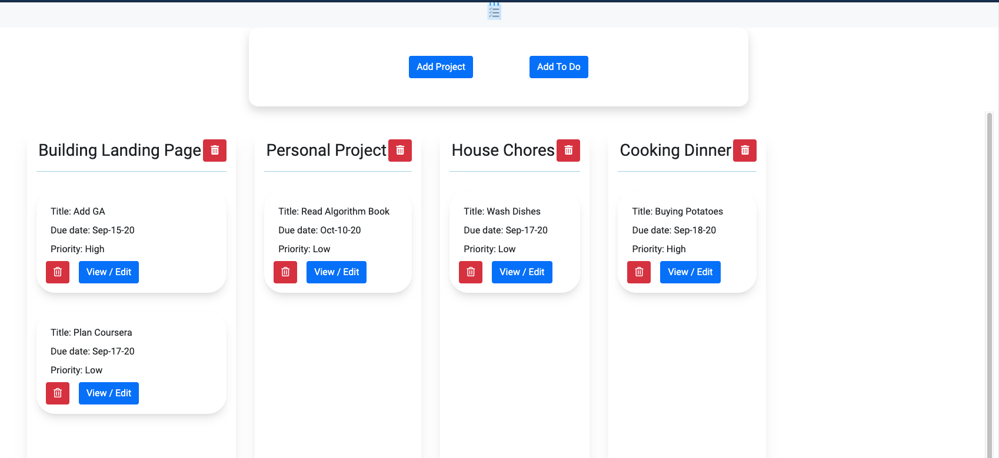

# To Do List - A Microverse educational project

Building a To Do List App using JavaScript and Webpack. Learning how to apply Object Oriented Programming bes practices. 

)

## Built With

-   HTML5
-   CSS3
-   Javascript
-   Webpack

## Live Demo

[Play Around](https://rawcdn.githack.com/santiagorodriguezbermudez/todolist/32e7b2a9bdd528f136d0722b89e97d68784d97e8/dist/index.html)

## Getting Started

- Fork the repository and create a local one on your computer;
- Move to the repository inside the command line using `cd` and the path to the file;
- open `index.html` file on your browser.

## Authors

👤 Nurislam Ab
- Github: [@nurislam-ab](https://github.com/nurislam-ab)
- Twitter: [@NurislamAb](https://twitter.com/NurislamAb)
- Linkedin: [nurislam-ab](https://www.linkedin.com/in/nurislam-ab/)

👤 Santiago Rodriguez
- Github: [@santiagorodriguezbermudez](https://github.com/santiagorodriguezbermudez)
- Twitter: [@srba87](https://twitter.com/srba87)
- Linkedin: [srba87](https://linkedin.com/in/srba)

## 🤝 Contributing

Contributions, issues, and feature requests are welcome!

## 📝 License

This project is [MIT](LICENSE) licensed.